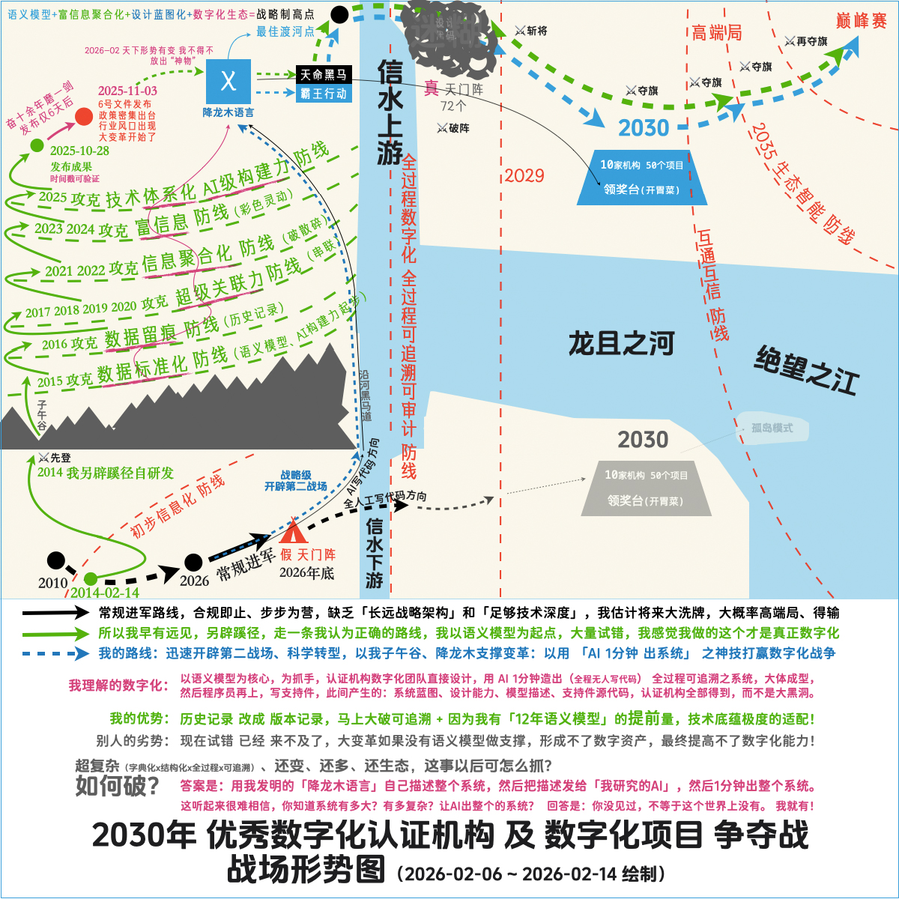

# 《认证机构管理系统可追溯之2030年数字化项目争夺战》战略合作伙伴征集

## 战场形势图



### 无巧不成书：“世界很大，充满神奇，天大的麻烦都有人能解”

#### 我的优势

以 **「语义模型」** 为起点的自研发，经过12年的探索试错，大面积压中政策发展方向

我的 <br/>12年技术底蕴    |政策原文        |匹配解读                                                |说明
--------------------------|----------------|--------------------------------------------------------|-----------------------------------------------------------------------------------------------------------------
语义模型                  |                |政策没说，但我判断： <br/>语义模型应该是数字化核心抓手  |《认证机构数字化管理技术指南》 <br/>所要推动的数字化转型目的是： <br/> **升级换代**的**真正**提升数字化**能力**
[千依子剑][]              |可追溯、可审计  |数据留痕                                                |这是2016年就实现的、底层的可追溯
[扶摇九剑][]              |数据结构化      |立体、可视化                                            |深度分析的前提、以及挖掘价值的前提

[千依子剑]: https://github.com/ca3w/01-dongfangshengong/blob/main/root/shengong/11-qianyizijian/BEST.md
[扶摇九剑]: https://github.com/ca3w/01-dongfangshengong/blob/main/root/shengong/01-fuyaojiujian/BEST.md

#### 12年技术储备 的 真实性

时间        |我发布         |备注
------------|---------------|-----------------------------------------------------------------------
2022        |哔哩哔哩       |我2022年就已经实现了数据留痕（这是AI生成的系统）
2025-05-16  |早5个月（我）  |我视频发布 抖音/快手/小红书/知乎视频/哔哩哔哩 等
2025-10-27  |仅1天前（要）  |《质量认证专业化能力提升行动方案（2025—2030年）》
2025-10-28  |               |我仓库发布 [GitHub][]发布 签名验证（时间不可篡改）
2025-11-03  |仅6天后（顺）  |《国家认监委关于提升认证机构数字化管理能力的指导意见（2025—2029年）》

[GitHub]: https://github.com/ca3w/01-dongfangshengong/commits/main/

## 我的策略调整

因为：政策有加快数字化的大趋势，所以我要将我原来的策略调整下，前置语义规则、全中文化。 <br/>
我判断将来认证机构会有较大压力，有远见的认证机构可能会愿意探索新事物，意识到这是变革！

#### 我原来的策略

用「语义模型->AI大模型智能体（AI造系统）」这种方式，自己造平台、造生态，用符文来区分。 <br/>
SaaS模式，不告诉认证机构这是由语义模型AI生成的系统，只说是AI、挣点小钱，了此残生罢了。

#### 调整后的策略

把语义模型汉化，全中文化，放出「语义模型」给感兴趣的认证机构玩，寻求逐步形成新的格局。 <br/>
以此大范围向认证机构转移架构能力、设计能力、甚至全部支持件代码，我退后重点做基础设施。

#### 2026-02 天下形势有变 我不得不 放出 “神物”

将来，靠人堆代码去应付合规，怕是不行了，不是数字化，一定会被淘汰...基于形势变化的需要

所以，我不得不放出我12年研发的 “神物” —— 基于语义模型的AI造系统（中文名称：[降龙木语言][]）

[降龙木语言]: https://github.com/XlmLang

```text
大势所趋，不得不为（如果不这么做，我也走不多远）

自己问大军师 DeepSeek （复制，粘贴）：

第一问：
认证机构的数字化转型，如此做法是否妥当：
以语义模型为核心，为抓手，认证机构数字化团队直接设计，用 AI 1分钟造出（全程无人写代码） 全过程可追溯之系统，大体成型，
然后程序员再上，写支持件，此间产生的：系统蓝图、设计能力、模型描述、支持件源代码，认证机构全部得到，而不是全部大黑洞。

当前形势之下，我机构是观望？还是初步探索？当行何种策略？如何赢得未来？

第二问：
认证机构的数字化转型，如此做法是否妥当：
我机构依据《指南》要求，向开发商描述，全部由开发商人工写代码来完成，如此方式实现「全过程可追溯」，全部体系都如此行事。
从长远看，全部人工写代码，是否能适应未来2029之要求，我机构当以何种方式应对未来数字化之新形势、新变化，到底应该怎么做。

第三问：
认证机构管理系统，全人工写代码，这条路还能走多远？2030年之后如果还在用：「全人工写代码的系统」那将意味着什么？请直言。

第四问：
认证机构的数字化转型，
「全人工写代码」怎么不行？我花钱、多花钱，找水平高的团队写，怎么就不行？我如果就是坚持这样，我机构能不能过的了2030年？

第五问：
认证机构的数字化转型，
大型机构，会不会因为坚持用「全人工写代码的系统」，导致机构被代码拖垮，成为「灰犀牛/黑天鹅事件」，大大暴雷？
小型机构，采用语义模型，用 AI 1分钟造系统，然后程序员再上，写支持件，最终逆袭，成为黑马，异军突起创造奇迹？
当前行业，是否存在巨大逆袭机会？我机构是否应该作出改变？
```

<br/><br/><br/>

***

<br/><br/><br/>

## 天门阵

天门阵文化起源：我预感到将来可能非常迷糊，抓数字化找不到中心点抓手，所以我要换个思路。 <br/>
系统好像天门阵：不得不进，进了就迷，还出不来，也整不了... 以后就是烂摊子，没人能够收拾。

我要把我的好东西放出来，都拿块木头，就不迷糊了，一切变得可控，演进也有章法，就不乱了。

#### 降龙木语言

将我12年形成的「语义模型->AI大模型智能体（AI造系统）」这种新方式，语义规则全改为中文， <br/>
将「语义规则」命名为「[降龙木语言][]」，放出来给感兴趣的认证机构使用，感受下新时代的神奇。

#### 霸王行动

大多数人，注定一生碌碌无为。不是不想，是根本没有机会干伟大的事。 <br/>
不能直接干，把火箭🚀发到天上去，再收回来、接住，不能干「星辰大海」之事！

与其以 “数字化” 之名，用嘴描述、等人堆码、漫长等待、循环往复，应付合规、无以未来...... <br/>
不如与我干 “用 AI 1分钟 出系统” 之伟大事业！以前卫、探索研究的态度去拥抱真正的数字化。

希望得到一些感兴趣的机构支持，花点钱玩我的「降龙木」感受神奇、以支持我能继续发展下去。

开辟 “第二种可能” ，就像二战直接登陆欧洲，开辟第二战场一样，我们要直接进入真正的数字化： <br/>
我们也可以直接登陆“数字化”，开辟第二可能，集合多方的力量，以偏学术的方式，创造科技奇迹！

拿起你的手机：封 DeepSeek 为军师，你和你的军师一起学我发明的「降龙木」语言，用AI造系统。 <br/>
如此，谓之曰：「霸王行动」（吾辈之使命、后辈也会因为你、能直接参与这样伟大的行动而骄傲）

「前卫开发者」联合「前卫机构」开展的「数字化转型之战」：一起用国产AI造认证机构管理系统！

「霸王行动」期待您的参与！共同创造荣耀！

<br/><br/><br/>

***

<br/><br/><br/>

#### 名言

> 在此留下一句名言（2026-02-14）

以后的系统，会非常非常的复杂， <br/>
但却不是千军万马能搞的，人多去弄、反而不行， <br/>
而是对的人、正确的方法：**宝剑出鞘，一人便是千军万马。**（这是AI时代！）
