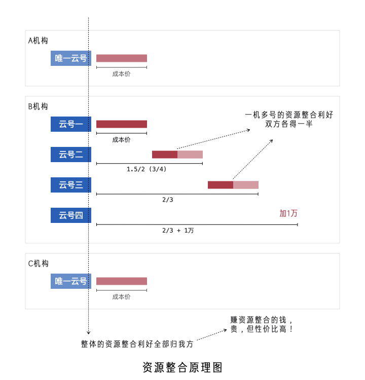
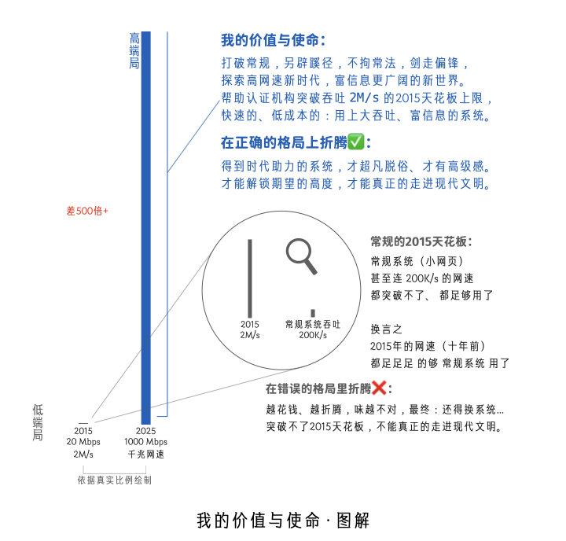
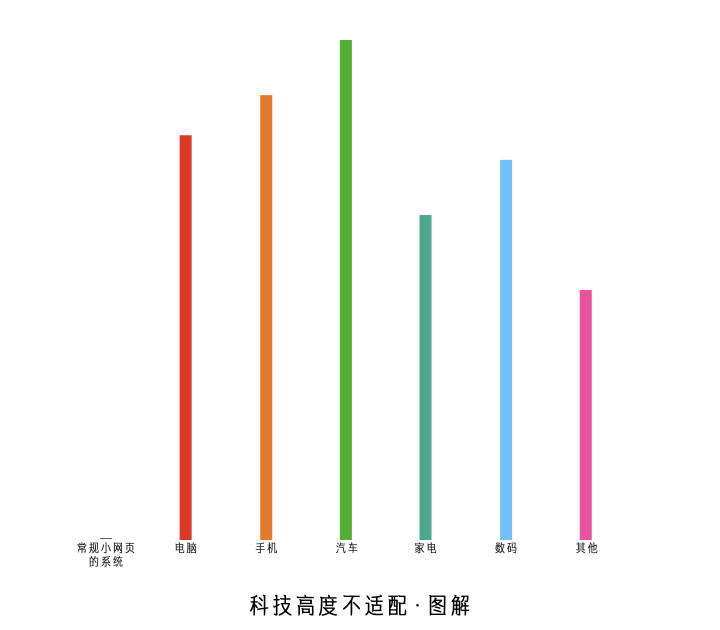

# 年费深度解读

## 为什么交年费、为什么贵？

### 时代不一样了

网速的高度，决定着系统文明的层级，或者是说认证机构的消费档次

过去低网速：200K/s、1M/s、2M/s <br/>
&nbsp;&nbsp;&nbsp;&nbsp;&nbsp;&nbsp;&nbsp;&nbsp;怎么做，都是「初步信息化」，无非是谁的流程更合理一些而已 <br/>
&nbsp;&nbsp;&nbsp;&nbsp;&nbsp;&nbsp;&nbsp;&nbsp;谁都实现不了「信息高级化」（富信息），实现了网速也带不动 <br/>
&nbsp;&nbsp;&nbsp;&nbsp;&nbsp;&nbsp;&nbsp;&nbsp;富信息 == 做梦（拉不开层级：网速决定了上限，只能是小网页）

> 低网速时期的系统形势：别管啥系统，大机构、小机构谁都上得起

```text
低网速时期的系统格局：「拉不开层级」

    只有流程合理之分，没有文明层级代差

    你想多花钱弄好的，也拉不开多大差距（就算是你当时花5000万弄成的好系统，将来也得扔）

    将来也得扔：
        穷信息系统是不可能改进成富信息系统的
        就像
        自行车不可能改进成真正的汽车，就得扔

        不换系统：
        时代免费给你的油（高网速），得天天扔

        终将富信息（早早晚晚的事），孰轻孰重？

        你再也办不了 2兆、4兆、10兆 的宽带了
        都没人卖你了 淘汰了 服务商再不会出了
        还继续用适配 低网速 的系统吗？怀旧吗？ 😄

```

现在高网速：20M/s、100M/s、千兆、无限 <br/>
&nbsp;&nbsp;&nbsp;&nbsp;&nbsp;&nbsp;&nbsp;&nbsp;富信息不再是做梦，时代解锁新选择：富信息，这就拉开层级了 <br/>
&nbsp;&nbsp;&nbsp;&nbsp;&nbsp;&nbsp;&nbsp;&nbsp;谁有钱、谁就高级（网速拉开层级：除了小网页，还可以富信息）

> 就像买车、烧的起油一样，谁的系统更猛、烧的起网速，谁就高级

> 高网速时期的系统形势：依然还有小系统，10万、20万买到手能用 <br/>
> 但有的机构是花了大钱交年费用的富信息，小系统一定是比不了的

```text
高网速时期的系统格局：「拉开层级了」

    不唯流程合理之分，而有文明层级代差

    高等文明的富信息，高级化的各种更合理，低等文明是没有办法想象的

    富信息文明层级 (前卫+先进+厚重)
        用上 高维、多彩、灵动 等新的科技点
        高信息密度，更清楚、更明白，更高雅
        本质是研究：「高网速」时代赋能得用🛸，前卫性/颠覆性 在这里

    穷信息文明层级
        这个表、那个表、一堆表、非常的单薄
        信息密度低，相对难使用，相对碎片化
        本质是折腾：2M宽带就能用的旧毛线🧶，残酷的是：不值得折腾了

        为什么「不值得折腾了」：
            「系统/网速」 好比 「出行/路况」
                论「出行」，依现在世界之路况
                    值得研究：发动机、变速箱、底盘...
                    不值得折腾：脚蹬子、车链子、三角座垫...
                论「系统」，依现在世界之网速
                    值得研究：高级功能体系，富信息、大吞吐...
                    不值得折腾：低维列表，这个表、哪个表、一大堆...

    富信息一出一比一显，原来的就显得不好了
    显得碎片化，信息不集中，各种不好不高级

    差距本质：
        有钱机构上「富信息」，无钱机构还用「穷信息」
        「富信息」依靠高维、上色、灵动，及大吞吐，所拥有的高级优势，「穷信息」没有任何平替方案
    通俗的讲：
        有钱机构的新系统：看的是一艘船、一看就懂
            一个请求，就传来 50M 的数据：以高维、多彩的方式大面积呈现，让人一看就懂、清楚明白
        无钱机构的旧系统：看的是小木块、脑补局部
            一个请求，只传来 <1M 的数据，没什么信息聚合、更谈不上高维，就是密度低碎片化的信息

        高网速环境大家都有，但差距是：
        有钱机构看的是：信息聚合后的高密度信息，一看就懂、清楚明白，是在享受时代的最新发展成果
        无钱机构看的是：一点又一点的碎片化信息，至于「聚合/高维/上色」，只能脑补、累！还补不上

        对于「聚合/高维/上色」这个活：
            有钱机构：系统完成、背后是服务端CPU计算、使用端CPU渲染，都是代码让CPU干的活
                系统除了：数据创建、数据更新、数据列表、数据删除，这些活
                    还干：数据聚合、数据高维、数据上色、数据灵动，这些活
            无钱机构：系统肯定是干不了这个活，一分钱一分货，穷信息就是没有深加工这种能力
                系统只干：数据创建、数据更新、数据列表、数据删除，这些活

技术本质是什么？
    「穷信息/旧系统」
        使用者 -- 系统 ---------------------- 数据库
        使用者不会直接操作数据库，系统作中间人帮你中转，但不作深加工
    「富信息/新系统」
        使用者 -- 系统 -- 算法/引擎/逻辑/API -- 数据库
        可以简化为
        使用者 -- 系统 -- 深加工 -- 数据库

    本质：
    「穷信息/旧系统」
        使用者 -- 系统 ----------- 数据库
    「富信息/新系统」
        使用者 -- 系统 -- 深加工 -- 数据库

    富信息系统更尊重使用者：
    在高网速这种时代环境下，把粗信息深加工成高密度信息，再给使用者看、以此表示尊重

    过去搞「深加工」不现实，搞成「高密度信息」，没有「高网速」，也没办法传到使用端
    现在网速高，传输不是问题，所以能这样：让使用者看更清楚、更明白、更高雅的富信息

    如果把零零散散往系统里录入的数据比作：高粱、玉米、大米、小麦，那么可以这样理解：
        「穷信息」看信息，味同嚼蜡：撸高粱穗、啃玉米棒、生吃水稻、嚼小麦杆
        「富信息」看信息，如饮美酒：更加讲究、更加好吃、更加进步、更加文明

```

***

拉开层级，其实就是两个文明： <br/>
就像「拿按钮手机的人」和「用智能手机的人」，谈论「手机」一样

&nbsp;&nbsp;&nbsp;&nbsp;&nbsp;&nbsp;&nbsp;&nbsp;都在说「手机」，实际不是一个东西 <br/>
&nbsp;&nbsp;&nbsp;&nbsp;&nbsp;&nbsp;&nbsp;&nbsp;「按钮手机」在显示上，太过单薄，很多东西都不一样

&nbsp;&nbsp;&nbsp;&nbsp;&nbsp;&nbsp;&nbsp;&nbsp;富信息系统的道理和这个其实差不多，贵，有贵的道理

&nbsp;&nbsp;&nbsp;&nbsp;&nbsp;&nbsp;&nbsp;&nbsp;你买到手死放着、或者自部署花不了几个钱的那个系统 <br/>
&nbsp;&nbsp;&nbsp;&nbsp;&nbsp;&nbsp;&nbsp;&nbsp;和 <br/>
&nbsp;&nbsp;&nbsp;&nbsp;&nbsp;&nbsp;&nbsp;&nbsp;别人每年交年费，你觉得太贵不值的那个系统 <br/>
&nbsp;&nbsp;&nbsp;&nbsp;&nbsp;&nbsp;&nbsp;&nbsp;或许 <br/>
&nbsp;&nbsp;&nbsp;&nbsp;&nbsp;&nbsp;&nbsp;&nbsp;真不是一个东西，差着“十万八千里”

***

过去网速低，恰如过去村里面坑坑洼洼、泥泞不堪，没人买车一样，没人富信息、只能是自行车 <br/>
现在网速高，恰如现在村里面路修的好，阳光大道，有人买车一样，交年费，用富信息享受时代

我的观点是： <br/>
&nbsp;&nbsp;&nbsp;&nbsp;&nbsp;&nbsp;&nbsp;&nbsp;依目下的时代环境来看， <br/>
&nbsp;&nbsp;&nbsp;&nbsp;&nbsp;&nbsp;&nbsp;&nbsp;如果一个认证机构还没用上高维、多彩的富信息， <br/>
&nbsp;&nbsp;&nbsp;&nbsp;&nbsp;&nbsp;&nbsp;&nbsp;那么说明这个机构的信息化建设，还没有走进这个时代应该达到的现代文明。

&nbsp;&nbsp;&nbsp;&nbsp;&nbsp;&nbsp;&nbsp;&nbsp;就是说系统还停留在：15年、10年，那个时候的文明，这些年发展最快的其实是网速 <br/>
&nbsp;&nbsp;&nbsp;&nbsp;&nbsp;&nbsp;&nbsp;&nbsp;系统文明早就迭代了，系统真正的现代文明是富信息，任何低密度信息 Out ，时代不一样了

### 认清形势，就是贵的

以下是我对「认证机构管理系统」这个行业的「时代划分」及「未来趋势」的判断：

时间       |系统时代      |时代标志              |时代区别                |起点界定
-----------|--------------|----------------------|------------------------|----------------------------------
2000-2025  |穷信息时期    |列表、表单，初步堆成  |小网页                  |2000年，ADSL 2Mbps 200K/s
2025-2055  |前富信息时代  |高维、多彩，体系建设  |大吞吐 丨 没有泛化底蕴  |2025年，流量卡 200Mbps 20M/s
2055-XXXX  |后富信息时代  |高维、多彩，生态发展  |&nbsp;&nbsp;&nbsp;&nbsp;&nbsp;&nbsp;&nbsp;&nbsp;&nbsp;&nbsp;&nbsp;&nbsp;&nbsp;&nbsp;&nbsp;&nbsp;&nbsp;泛化底蕴形成  |2055年，保守估计，实际可能2065年

#### 2000年以前

由于那个时候网速非常的低，不到2KB/s，不大可能有联网的系统，只能是一些单机版的小软件

#### 2000-2025

随着 ADSL 2Mbps 200K/s 的普及，网页类系统具备了使用的条件，但也要延后5年左右才产生

#### 2025-2055

以一般流量卡达到 20M/s 为标志，富信息具备了使用条件，以「大吞吐」的优势颠覆「小网页」

什么叫作以「大吞吐」的优势颠覆「小网页」？ <br/>
&nbsp;&nbsp;&nbsp;&nbsp;&nbsp;&nbsp;&nbsp;&nbsp;「大吞吐」相对于「小网页」属于是「闭着眼睛、不用看你，百分百的碾压」 <br/>
&nbsp;&nbsp;&nbsp;&nbsp;&nbsp;&nbsp;&nbsp;&nbsp;这就好比： <br/>
&nbsp;&nbsp;&nbsp;&nbsp;&nbsp;&nbsp;&nbsp;&nbsp;一支弓箭，再用好材质，再做的精细，都没用，无论怎样都比不上一发炮弹。 <br/>
&nbsp;&nbsp;&nbsp;&nbsp;&nbsp;&nbsp;&nbsp;&nbsp;就相当于： <br/>
&nbsp;&nbsp;&nbsp;&nbsp;&nbsp;&nbsp;&nbsp;&nbsp;2025以后：这个表、那个表、一堆表，弄系统，最后折腾完就是一堆小网页， <br/>
&nbsp;&nbsp;&nbsp;&nbsp;&nbsp;&nbsp;&nbsp;&nbsp;无论如何，也比不上别人一个请求就传输50M数据的那种， 而且是望尘莫及。

「体系化的富信息」，当然好，但由于「没有泛化底蕴」，开发商就很少、开发成本也高、当然贵 <br/>
这个时期上富信息，就相当于：70年代买车、80年代住楼、90年代用大哥大、 2010年用苹果手机 <br/>
贵的前卫！当然我说的是这种：体系化的全面用上富信息，不是零散的、片面的，不成体系的那种

贵的前卫： <br/>
多花点钱，交年费用，比省钱的，更值得，前卫的东西不是所有人都懂，有些人就是要错过前卫的 <br/>
目前我们正处于这一阶段：价格就是贵的，但性价比极高，多花点钱真能比别人牛太多的特殊时期

```text
有些人就是要错过前卫的：

    系统每年投入的费用（年费），几乎是零：

        如果
        网速是 200K/s 1M/s 2M/s ，看不出什么大问题

        但是
        网速是 20M/s 100M/s 1000M/s ，那就有问题了

    就是说：你的信息化建设，每年花出去的钱，太少、或者没有，
    水涨了船没高，你以为省钱了，实际上是时代资源白白浪费了。

    符合时代、正确消费：
    和「高网速」对应的「大吞吐」的钱，每年都能花得出去，才是享受时代、才是一身贵气、才是福泽深厚...

```

```text
特殊时期：2025-2055

    这就好比 手机 的 特殊时期，大概是：2010年-2015年
    认证机构 系统 的 特殊时期，应该是：2025年-2055年，越前面当然越惊艳！

    直白的讲：

        我设计的这个富信息的系统，
            一定像 iPhone 4 颠覆 手机行业 一样，
                 颠覆 认证机构管理系统 这个行业，而且连续30年都是巅峰！

        —— 这是宿命论、注定的，天命如此，谁也改变不了。

```

#### 2055-XXXX

泛化底蕴早晚会形成，所谓的泛化底蕴就是指：技术发展，产生低成本就能富信息的成熟底层框架

> 泛化底蕴形成了，未必就都是好事：70年代造车，和现在造车，科技含量是不一样的，好坏易分 <br/>
> 一大堆人都能做，你就很难分辨出：谁真懂设计，谁在瞎糊弄，甚至会劣币驱逐良币，好坏难分 <br/>
> 真正好用的产品，在划时代的时候才是最惊艳的。大家都跟风，买到也不是那个味了，不经典了 <br/>
> 因为真正的大师，只赚点前卫的钱，不赚卷的钱。品质只在前卫里，不在互卷中，好东西不常有

「趋势+基础+应用」的人非常少，而只会「应用」的人却很多，那时候能做富信息的人可能就多了 <br/>
可选择的多了，自然有便宜的，就像你今天2万就能买辆车一样，但那时候的富信息就不比别人牛了

2055是非常保守的估计，考虑到富信息的高精尖，要在认证机构这个领域落地，怕是还要延后10年

2065年，富信息系统可选择的商家可能会多一些，到时或许可能有便宜的，但大概率：便宜没好货

还有可能更晚，百年稀缺罕见： <br/>
由于富信息系统的超级复杂，以及行业非常小众，进而导致一百多年、 没有人为此做专门的基础研究 <br/>
就像今天条件非常好，反而拍不出经典武侠片了，没人愿吃那份苦了，就算到了2125年也没多少选择

经典，领先一百年、甚至二百年，都是有可能的... <br/>
就是说别人50年前、一百年前，就造出来的东西，不仅是世界上最好的，而且是任何人没办法仿制的

***

你也可以现在就富信息，找我做就可以，贵一点，交年费，用到2065年，40年不用换系统、不过时 <br/>
甚至：50年后依然经典，泛化底蕴出的，可能难以撼动我数十年的积累， 可以一辈子只用一个系统 <br/>
甚至：百年经典、能用很久... 不三五年一折腾，才能良好的积累，进而形成有价值的百年级大数据...

<br/><br/><br/>

***

<br/><br/><br/>

## 年费到底是根据什么定价？

根据 **赔钱喝粥赚整合** 这个 **神逻辑** 定的价，是精算出来的（当然不是拍脑袋想出来的）

#### 赔钱喝粥赚整合

一家机构一个云号，授权费也好年费也罢，细算其实都是赔钱的，但我要赚钱，赚的是资源整合

年费实际是赔钱的，但可以视作是成本价，相比于该机构自己运营服务端，实际上是没赚什么钱 <br/>
&nbsp;&nbsp;&nbsp;&nbsp;&nbsp;&nbsp;&nbsp;&nbsp;**神逻辑是**： <br/>
&nbsp;&nbsp;&nbsp;&nbsp;&nbsp;&nbsp;&nbsp;&nbsp;这个前卫、这个吞吐、这个生态，还有人工呢 <br/>
&nbsp;&nbsp;&nbsp;&nbsp;&nbsp;&nbsp;&nbsp;&nbsp;我当然没赚你什么钱，我赚的是资源整合的钱

#### 一机一号

单一认证机构使用一个云号，与其他机构构成资源整合，所产生的利好，当然是全部归我方所有

因为： <br/>
&nbsp;&nbsp;&nbsp;&nbsp;&nbsp;&nbsp;&nbsp;&nbsp;技术上是我方实现的、生态上是我方主导的 <br/>
&nbsp;&nbsp;&nbsp;&nbsp;&nbsp;&nbsp;&nbsp;&nbsp;唯有如此（赚资源整合的钱），才能性价比高（生态 + 资源整合 比 羊毛出在羊身上 更利他）

#### 一机多号

由于单一认证机构使用多个云号，构成资源整合，所产生的利好，我方让出50%（双方各得一半）

因为： <br/>
&nbsp;&nbsp;&nbsp;&nbsp;&nbsp;&nbsp;&nbsp;&nbsp;虽然：技术上是我方实现的、生态上是我方主导的 <br/>
&nbsp;&nbsp;&nbsp;&nbsp;&nbsp;&nbsp;&nbsp;&nbsp;但是：该机构自己付费的云号，就形成了资源整合 <br/>
&nbsp;&nbsp;&nbsp;&nbsp;&nbsp;&nbsp;&nbsp;&nbsp;所以：利好，双方各得一半

***



***

为什么值得： <br/>
赚资源整合的钱，贵，但性价比高！

你自己弄（对等的），要花的钱、更多，而且是非常多！ <br/>
不如很多机构都把钱给一个人，让一个人弄，大伙儿用。

必然是从「遍地开花」走向「术业专攻」： <br/>
科技含量指数级拉高、极高，你想自己弄、可能弄不了...

就像你买「批量生产」的东西，比自己做，那可划算太多了一样， <br/>
你花钱用「资源整合」的系统，比自己弄，性价比其实是极高的，贵，它也是极高的，不影响的。

贵，是因为你在拿「不对等」的系统在比，二者代码量、吞吐量，都是百倍级的差距，没可比性。 <br/>
账是这样算的：800块买艘“战舰”，比40块买张“弓箭”，贵，但性价比极高！多花钱、钱花得值。

<br/><br/><br/>

***

<br/><br/><br/>

### 为什么贵？

符合时代的产品、贵也划算！富信息系统莫说贵一点，就算是贵十倍，那也是性价比高、划算的

> 就是说：20万用穷信息，不如50万上富信息。就算是200万上的富信息，那也比穷信息划算！

```text
这个「性价比、划算」不是只考虑购买者经济条件，而是全方位考虑的获得的使用价值：
    打个比方：
    20万用穷信息，可能获得的是：别人投入8万创造的科技价值
    200万上富信息，获得的却是：别人投入500万创造的科技价值 + 连带获得不可估量的时代价值（网速发展的价值、芯片发展的价值）

系统作为工具：
    科技价值高，连带着高网速的价值、电脑好芯片的价值，都能炸出来！
    科技价值低，时代万千美好，止于系统，白白错失时代！连带损失大！

```

对照参考表：

对比项        |穷信息           |富信息
-------------:|:----------------|:-----------------------------------------------------
代码量        |50M 、 100M      |2G 、 3G 、 5G，甚至 10G+
科技含量      |碎片化           |体系化
每个单元格    |文本信息         |文本信息 + 维度信息 + 颜色信息 + 灵动信息 + 其他信息
使用者的感觉  |堆积感 + 单薄感  |科技感 + 厚重感 + 高级感

<br/><br/><br/>

***

<br/><br/><br/>

## 深度理解新时代

新时代（2025以后），认证机构管理系统，只有两种：「碎片化的穷信息」和「体系化的富信息」

&nbsp;&nbsp;&nbsp;&nbsp;&nbsp;&nbsp;&nbsp;&nbsp;「碎片化的穷信息」，不可能是体系化的做穷信息：做的人志大才疏 + 用的人非常的累 <br/>
&nbsp;&nbsp;&nbsp;&nbsp;&nbsp;&nbsp;&nbsp;&nbsp;「体系化的富信息」，不可能是碎片化的做富信息：做的人非常的累 + 用的人晕头转向

高网速环境、好芯片电脑，系统技术上限解锁，但： <br/>
只有真正懂架构、懂设计、技能成体系、独具匠心的人，才能搞出 2G 、 3G 、 5G 的富信息系统 <br/>
多数人是没有这个能力的，只能是换瓶不换酒、CURD堆常规的小网页 50M 、 100M 不可能太大

穷信息上限是单薄的管理，但不可能显示的非常清楚明白；只有富信息才能显示清楚、显示明白

<br/><br/><br/>

***

<br/><br/><br/>

## 我的价值与使命

在最好的时代，下最深的功夫： <br/>
专为认证机构打造和高网速相适配的、大吞吐的、富信息的、生态发展的高端认证机构管理系统。



#### 格局拉开的原因

时代巨变 + 行业小众 + 神力神助

时代巨变：不到十年，网速翻数百倍 <br/>
行业小众：认证机构管理系统，没多人知道、没多少人懂，专做这个的就更少了，顺带做的不够专业 <br/>
神力神助：认证机构的系统具有高度复杂性，大吞吐、富信息，确确实实能够大幅度提高系统的品质

> 大众行业，比如游戏，肯定会出：只有最新手机才能玩得动的游戏，锚定硬件、追着时代在做研发...

```text
神力神助
    神力：高网速
    神助：大吞吐、富信息，大幅度提高系统的品质，如得神助

如果认证机构的系统像博客列表、新闻列表一样，就几个字段，归属分类就OK，那么：神力无助 😿
    即：大吞吐、富信息，就没什么意义，根本就用不上...

可事实是认证机构的系统恰恰具有高度复杂性，大吞吐、富信息，有着非凡意义，非常非常有用 👍🏻
    甚至是：富信息已是现代系统的核心灵魂，没有不行...

```

#### 富信息的紧迫性

房子，没有钱、可以买小的，不影响睡觉... <br/>
车子，没有钱、就买亲民的，不影响代步... <br/>

系统，如果是拉开时代差了，就得买好的... <br/>
否则，你根本就够不着时代，影响看数据...

就像手机得买智能机，不能买按钮机一样...

够得着时代，是紧迫性的关键，是必须的...

#### 低端的自测方法

> 低端就是够不着时代的、就是淘汰的

在路由器上限速自己，把自己限制成：10 Mbps (1M/s) <br/>
系统还能正常的使用，几乎没什么影响，那就说明：这个系统不是真正的大吞吐

甚至是限制成：2 Mbps (200K/s)， 你的小网页系统还跑的飞快， 一点儿不影响 <br/>
这就说明高网速你没用上，时代的赋能你没用上，你在用2015、2010年前的系统

别人是限制成：20 Mbps (2M/s)，非常卡、感觉都不能用，那说明别人的系统好 <br/>
就好比你拿出2015年的手机，都玩不了的游戏，那才是好的游戏一样，值得你玩

都不限制网速，现代环境（你懂）： <br/>
别人看信息当然比你清楚、明白、极度舒适，因为别人的信息密度比你高太多了

> 别人用上了高网速，得到了时代的赋能，而你的没用上，就是小网页堆出来的

#### 必须富信息的四个理由 —— “四高”

低端当然不行，认证机构上系统必须要高端，这里给出四个必须富信息的理由，简称：“四高” ：<br/>
网速高速、周边高档、品味高级、正用高端

第一高：网速高速

上面已经论述过了，小网页已经有了不可逾越的2015天花板，已经不符合时代，必须得用高端的 <br/>
> 即：2015年的网速，小网页的系统，都是用不了、浪费的，时代白给的资源、用不上就是低端

第二高：周边高档

2015-2025，十年间，各行各业都在发展，而且是高速的发展，各种进步、各种突破、各种革新 <br/>
而常规化的认证机构管理系统却没有革新，原地踏步。觉察力高的人，早就觉察到了，不说而已

你从高级感家里出发，拿着高级感手机，开着高级感汽车，打开高级感电脑，打开系统秒变低级 <br/>
瞬间就跌回了2010年，而且系统几乎是没有丝毫的高级感，和现代周边配套，科技高度落差太大



随着时间的发展，就会愈发的觉得：周边啥啥都比这个破系统高档，甚至会厌屋及乌的厌烦工作

第三高：品味高级

随着刷手机短视频，买各种好东西，你会变得越来越识货，小网页简单操作数据库没什么厚重感 <br/>
慢慢的你就会厌烦：使用者成了碎片化操作数据库的牛马。即：系统并没有真正做有深度的工作

系统没做有深度的工作，除了CURD数据库，其实没帮你做什么，你就会感觉系统不给力、 想换... <br/>
换一个又一个都不满意，如果不突破2015天花板、不做富信息的，好坏都差不多，始终是难如意...

第四高：正用高端

系统对于认证机构来讲，属于核心关键现代工具，通过系统才能良好的驾驭数据，是正用的东西 <br/>
俗话说家伙事儿得好使，系统内在本质的是工具，有了好的工具，才能更上一层，变成驾驭数据

正用的东西，必须得用好的，上高端货！高端系统相比低端系统好太多，你内心的感受是不同的： <br/>
&nbsp;&nbsp;&nbsp;&nbsp;&nbsp;&nbsp;&nbsp;&nbsp;低端系统：我用这个，能**管理**数据，但没有驾驭感，本质原因是系统是碎片化的。 <br/>
&nbsp;&nbsp;&nbsp;&nbsp;&nbsp;&nbsp;&nbsp;&nbsp;高端系统：我用这个，能**驾驭**数据，这是神器！没有这个不行！没有东西能代替！

#### 或许我是天选之人

我早早就预见了今天的问题：高网速如果来了、小网页必不相配，多年来一直在研究解决的方案 <br/>
进行了大量的基础研究工作，不断探索、不断试错、经过不懈努力，逐步摸索出一条富信息之路 <br/>
其中之艰辛非亲历不能体会：经过了无数次的失败与尝试，终于研究出成体系的低成本建设方案

我相信越来越多的认证机构会觉察到这个问题：常规小网页已经不符合新时代人们对系统的期望 <br/>
而我就是早早看透这一点的、做了充分的准备，与我合作是最有希望打赢富信息高端局这一仗的

富信息是非常深奥非常难的，没有足够的沉淀，是不可能短时间做好的、我觉得没有任何可能性 <br/>
临时抱佛脚、交付式走人等，终究是难成大器，做不出富信息的厚重感、折腾来折腾去不成体系

而我却有长期的积累、长期的沉淀，我的技能是成体系的，想上富信息系统，或许我是天选之人 <br/>
在网速骤高的新时代，用天选之人，才是最为明智的选择，时代变了，这个行业也应该走向整合

我会专做这个，做精、做细，把利他摆在利益前面，在符合时代与落地应用间寻找最佳的平衡点 <br/>
不负认证机构一次次换系统，执着背后的殷殷期盼，以成为认证机构的最后一次折腾为神圣使命

我会一直努力，不断的进步， <br/>
早做准备是在等待你的觉醒， <br/>
积累沉淀是在等待你的相信， <br/>
定规定价是在等待你的豪情， <br/>
天青色等烟雨，而我在等你...
